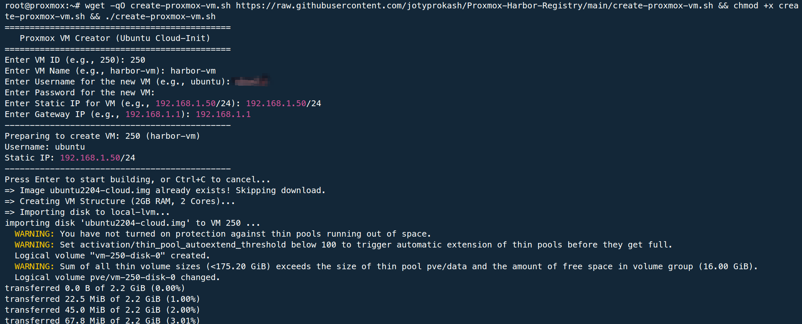
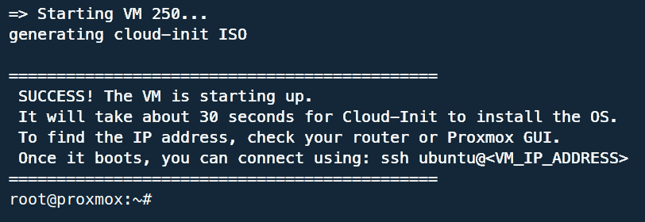
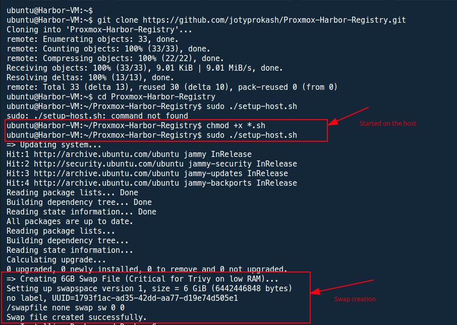
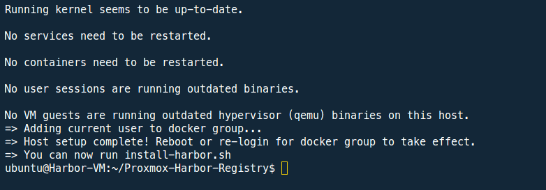
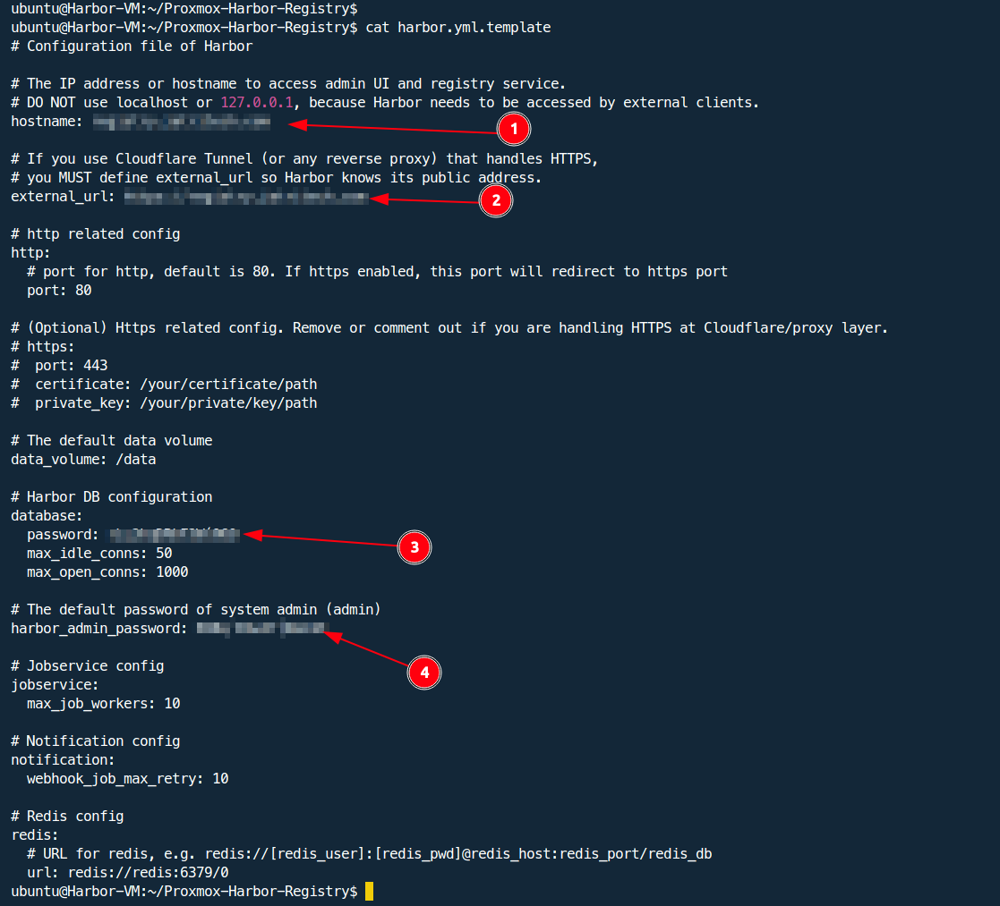
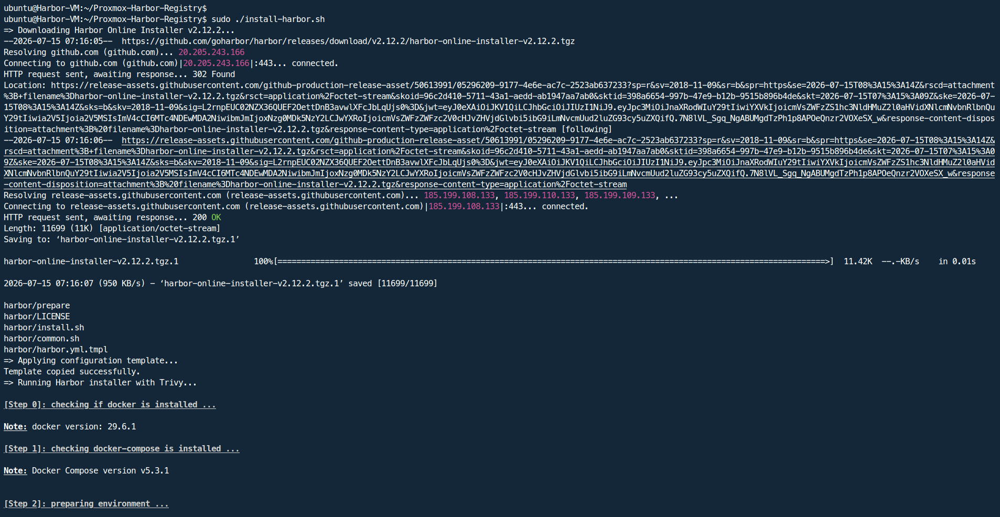
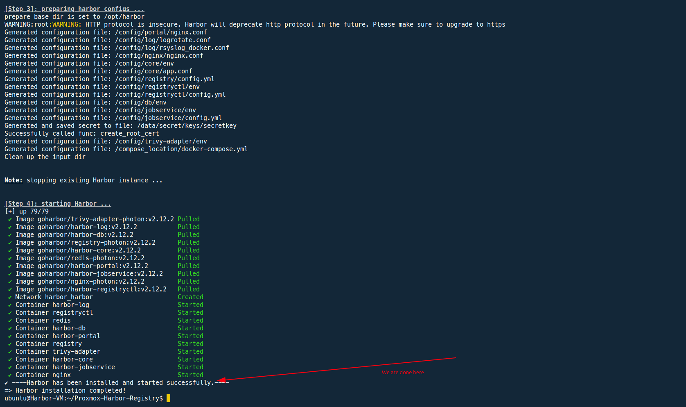
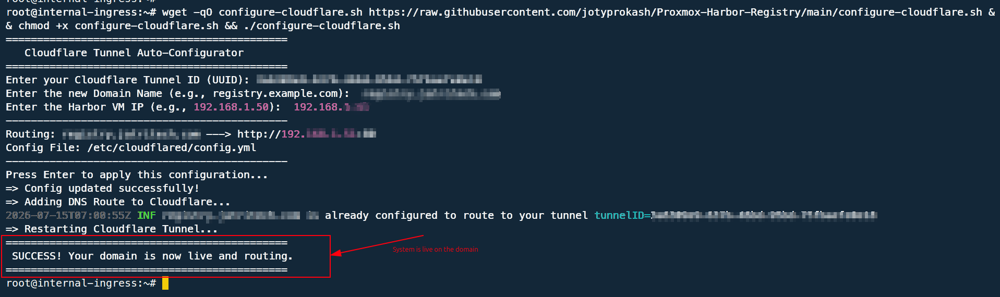
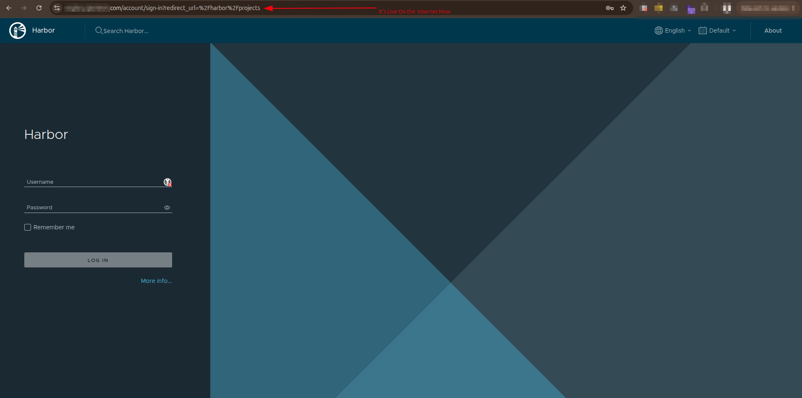

# Implementation Walkthrough

This guide provides a visual, step-by-step reference for deploying the Harbor Registry. Follow these visual cues to ensure exact reproducibility in your own Proxmox environment.

### 1. VM Provisioning via Cloud-Init

*Executing the automated provisioning script to define VM resources and static IP configuration.*

 

*Successful Cloud-Init injection and VM boot sequence on the Proxmox host.*

### 2. Host Setup & Docker Installation

*SSH into your newly created VM and execute the setup script to begin the system hardening.*

 

*System updated, 6GB swap space allocated for Trivy, and Docker engine successfully installed.*

### 3. Harbor Registry Installation

*Configuring the Harbor template with the target domain and secure credentials.*

 

*Pulling the required Harbor v2.12.2 and Trivy scanner container images.*

 

*All 10 Harbor microservices successfully deployed and running on the host.*

### 4. Cloudflare DNS Routing

*Injecting the Harbor VM local IP into the Cloudflare Zero Trust Tunnel configuration.*

### 5. Final Harbor Web Interface

*The fully secured, production-ready Harbor Registry interface accessed via Cloudflare.*

